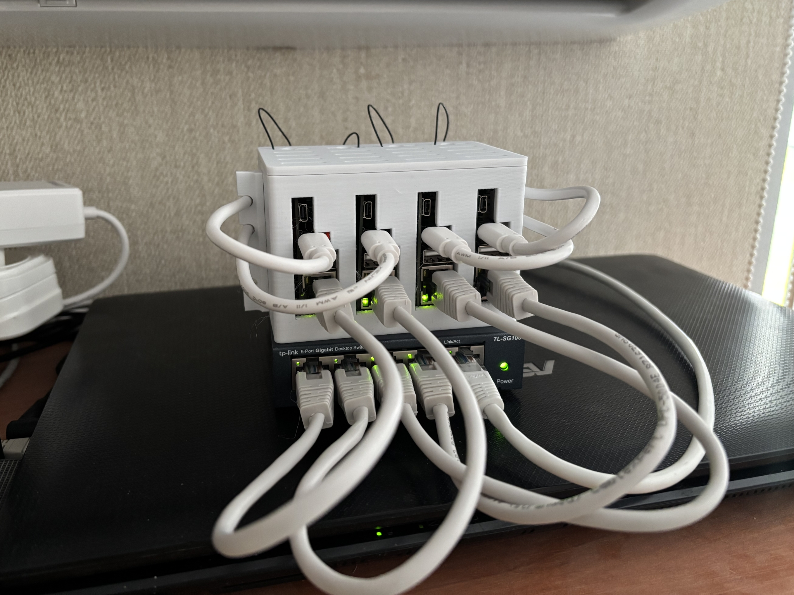
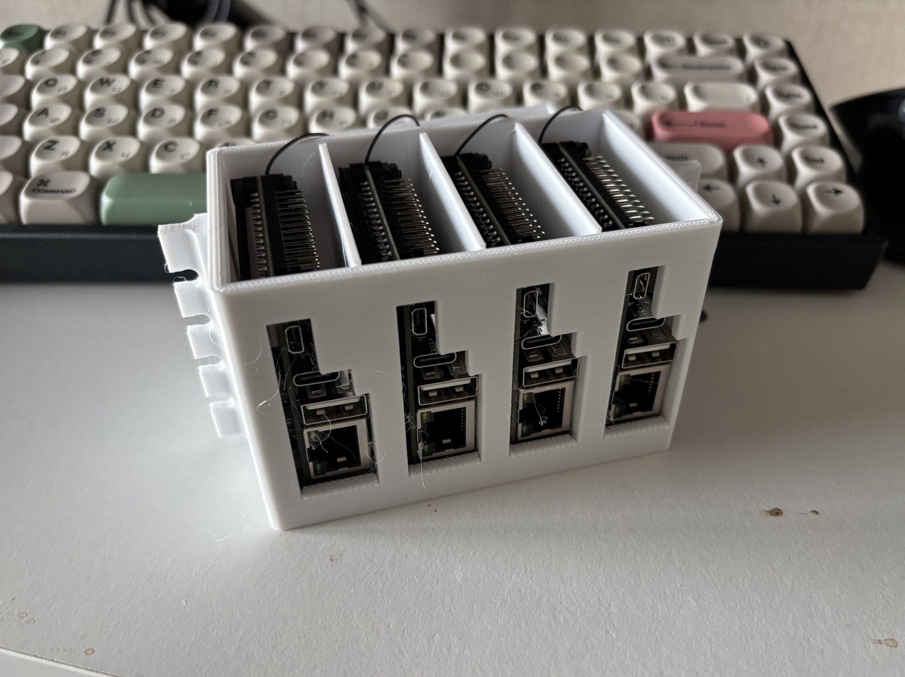
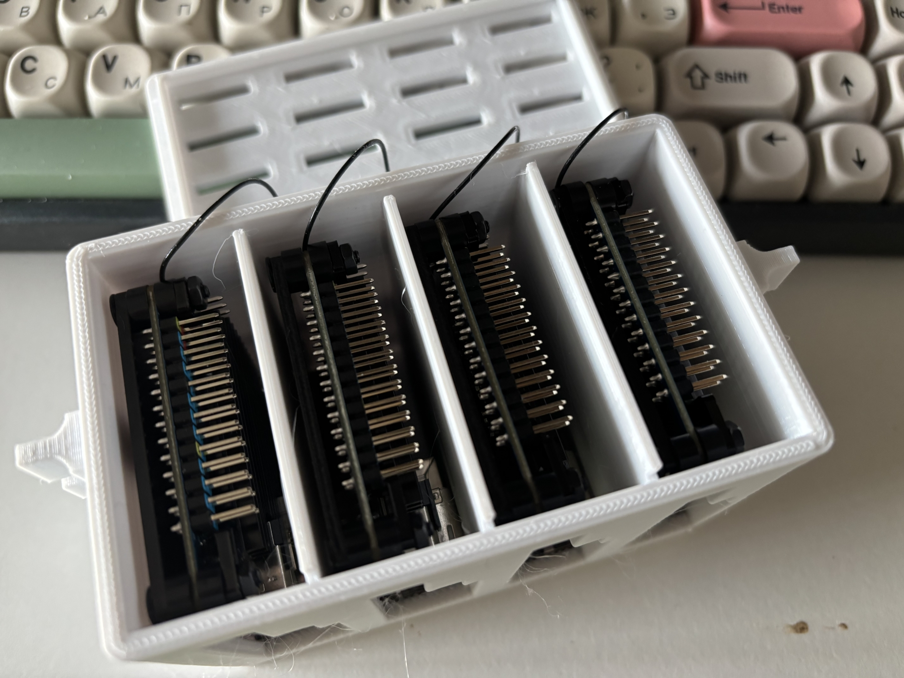
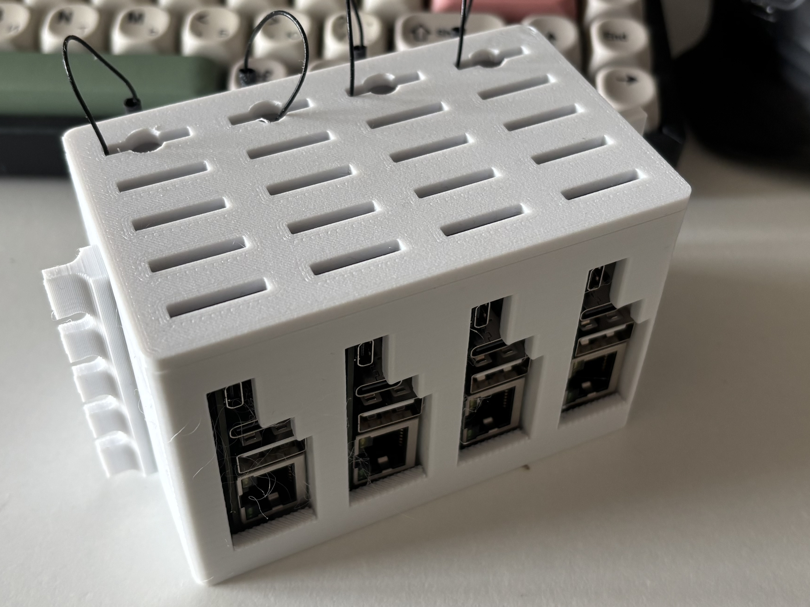
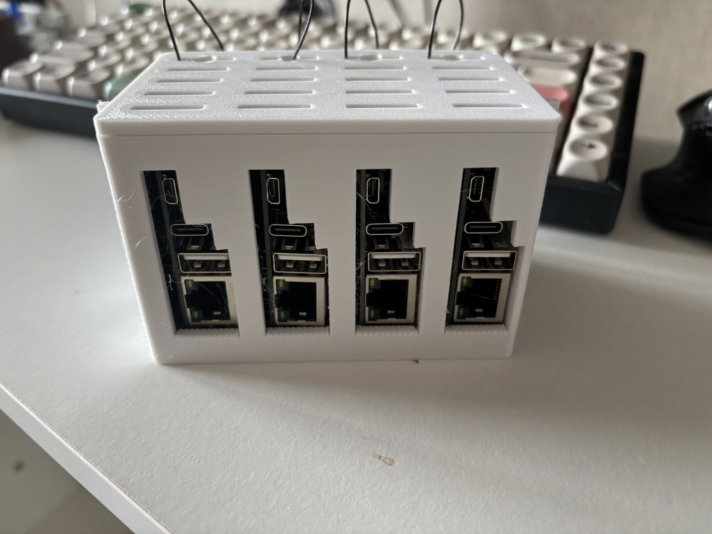
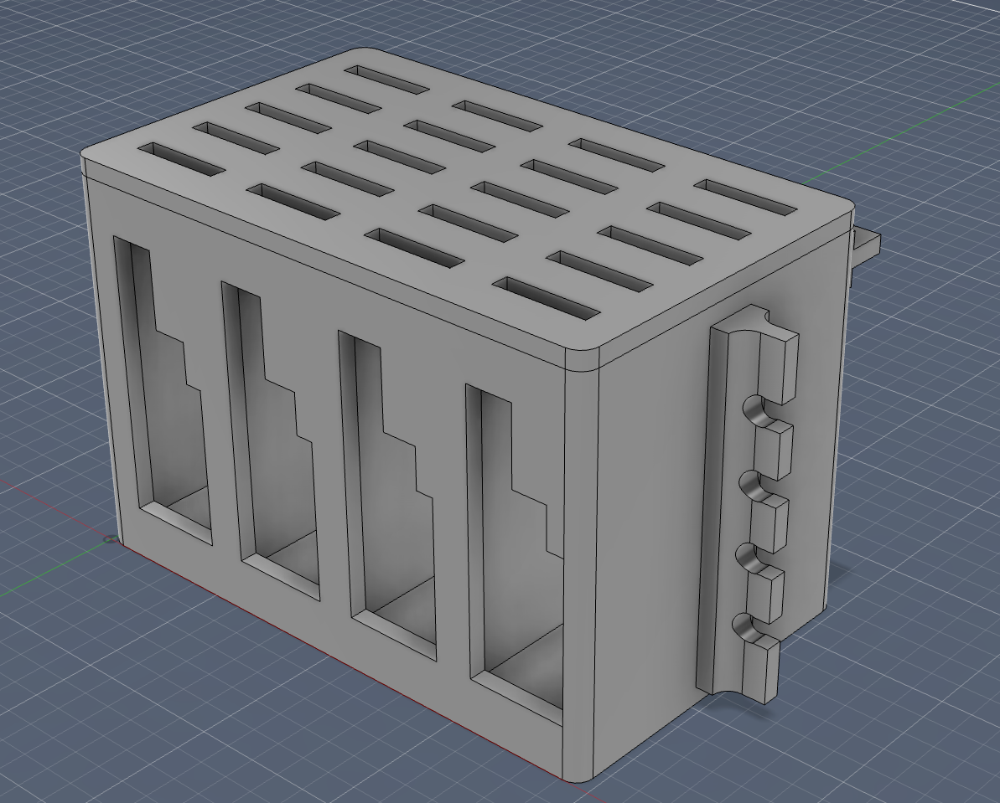
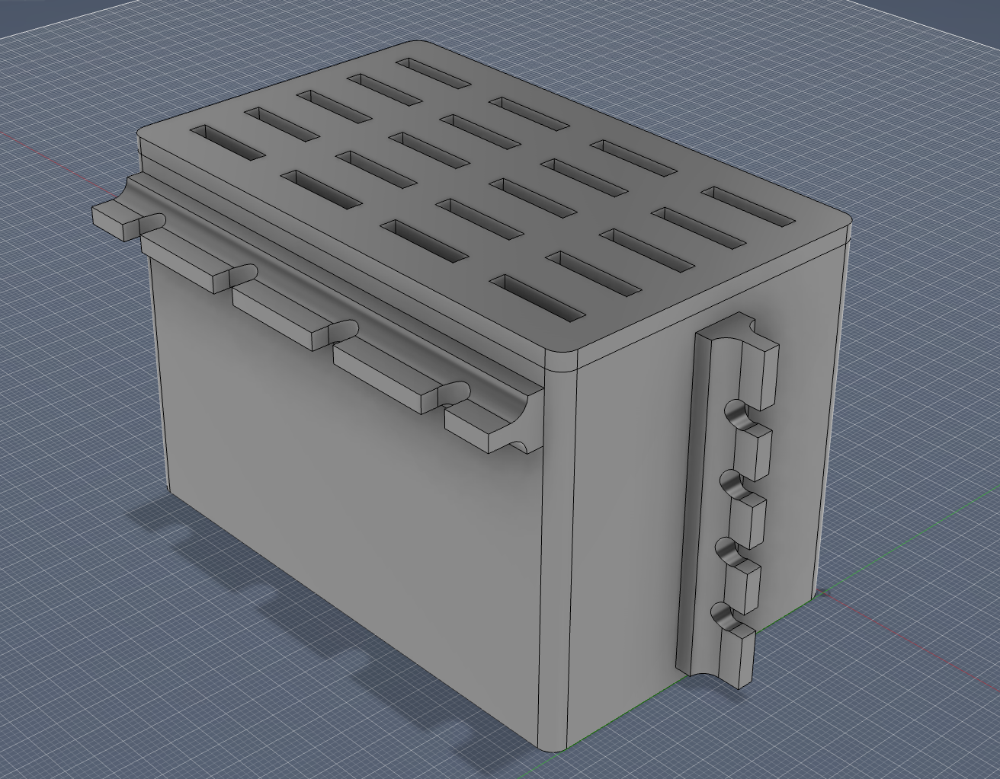

# Orange Pi Zero 3 Cluster Enclosure

A 3D-printed, stackable enclosure to organize Orange Pi Zero 3 boards into a neat cluster.

## Overview

This project provides STL files for a simple enclosure that holds multiple Orange Pi Zero 3 boards in a compact cluster.

It's designed to be easy to print, assemble, and scale while keeping ports accessible and cables manageable.

## Features

- Horizontally stackable design for 2+ Orange Pi Zero 3 boards.
- Passive airflow through side openings — no fans required.
- Access to all ports, except header pins.
- No screws needed for board mounting — friction fit.
- Cable and antenna clips for tidy wiring.
- Compact footprint.
- Easy to print on standard 3D printers.
- Customizable for different board counts.
- Open-source and freely available.
- Lightweight and durable.

## Assembly

1. Print all the parts.
2. Glue cable and antenna management clips to the sides.
3. Insert Orange Pi Zero 3 boards into the slots.
4. Put the top cover on.
5. Connect power and network cables — cluster ready.

## Files

Fusion 360 source:

- [OrangePiZero3Cluster.f3d](model/OrangePiZero3Cluster.f3d)

4-unit enclosure:

- [Enclosure](model/Enclosure-4U.stl)
- [Cover](model/Cover-4U.stl)
- [Cable clip](model/CableClip-4U.stl)
- [Antenna clip](model/AntennaClip-4U.stl)

## Example Prints

## Authors

- [Oleksandr Shepetko](https://shepetko.com).

## License

This project is licensed under the MIT License. See the [LICENSE](LICENSE) file for details.
